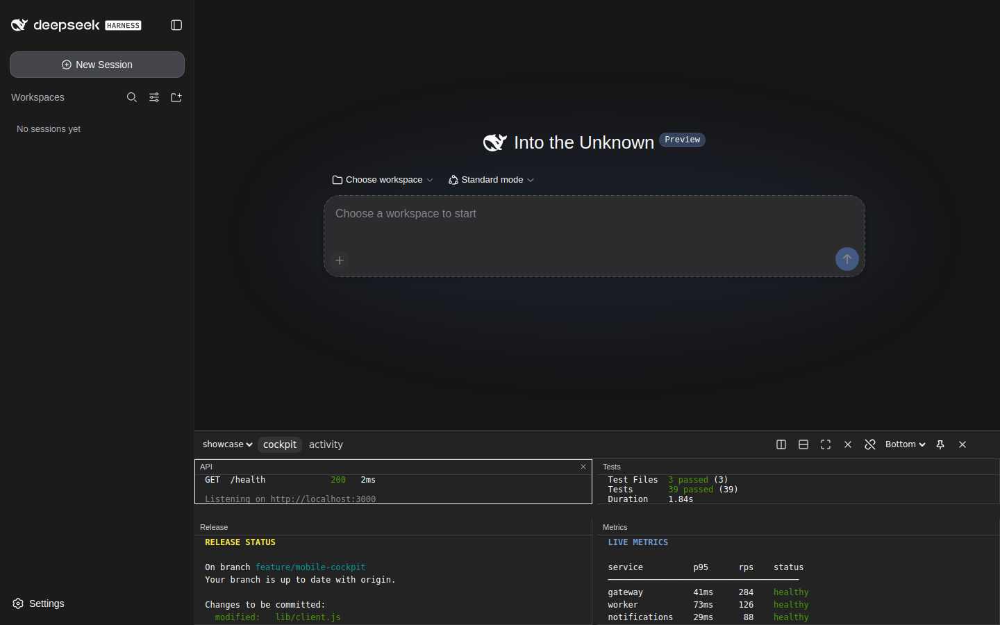
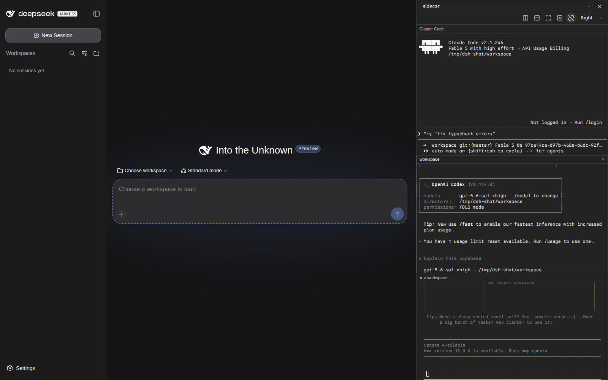
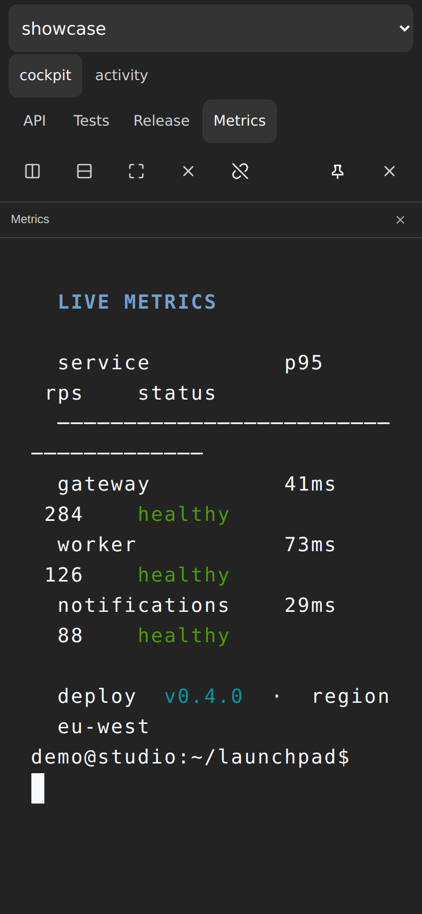
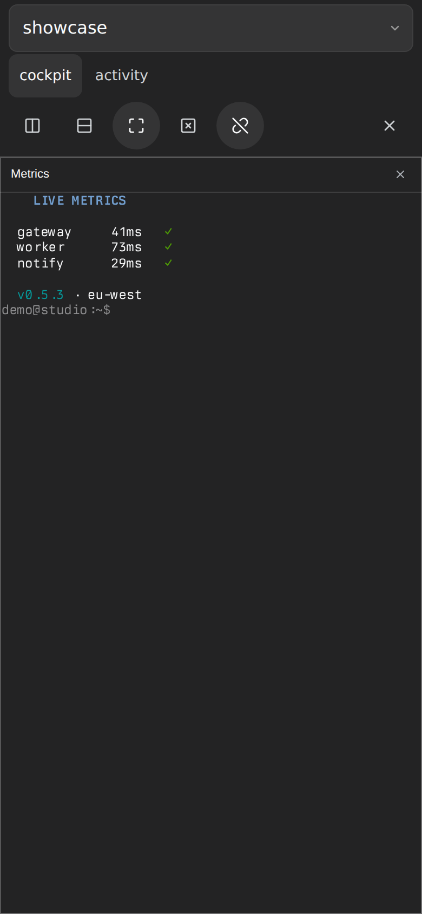

# dsh-tmux-cc

[简体中文](./README.zh-CN.md) · English

A persistent **tmux control-mode cockpit** for DeepSeek Harness Web. It attaches to an existing tmux session with `tmux -C`, renders every pane with xterm.js, and stays visible when you switch chats.

[](https://github.com/adrianleb/dsh-tmux-cc/actions/workflows/ci.yml)
[](https://github.com/topics/dsh-plugin)
[](./LICENSE)

> tmux owns the processes and layout; this plugin is only another view. It does not run tmux inside a browser terminal and does not require a PTY or native Node.js addon.

## Preview

<p align="center">
  
  
  <br /><sub>Desktop: bottom dock with six live panes — btop, Claude Code, Codex, a rolling CI log, omp, and a project README — mirrored without stealing window size (left); right-sidebar mode with three coding CLIs stacked (right).</sub>
</p>

<p align="center">
  
  &nbsp;&nbsp;
  
  <br /><sub>Mobile: the full-screen drawer preserves the real four-pane tmux grid (left); native <code>resize-pane -Z</code> zoom on the Metrics pane (right).</sub>
</p>

> [!NOTE]
> All screenshots were generated from an isolated DSH profile and a dedicated tmux server containing synthetic demo data only. No prompts were ever sent to the agent CLIs shown; they sit at their welcome screens. Nothing pictured contains private conversations, workspaces, or terminal output.

## Features

- **Persistent across chats** — the dock belongs to the DSH Web shell, not one conversation.
- **Native tmux panes** — pane layout, window tabs, focus, zoom, splits, and resizing stay synchronized with tmux.
- **Non-disruptive sizing** — mirror mode uses `ignore-size` while another terminal is attached; takeover mode provides a crisp 1:1 grid when the dock is the only sizing client.
- **Safe input transport** — input is forwarded byte-for-byte through hex-encoded `send-keys -H`, including Enter, paste, and Unicode.
- **Multiple sessions and windows** — attach, detach, switch windows, or launch an optional named session recipe.
- **Faithful mobile cockpit** — below 768px the dock becomes a full-screen drawer that preserves the real tmux pane grid and native pane zoom, keeps fonts at a readable floor with touch panning across the grid, and never lets the page scroll underneath it.
- **Bilingual UI** — English and Simplified Chinese follow the DSH locale.
- **No native dependencies** — the control channel uses plain stdin/stdout pipes.

## Requirements

- [DeepSeek Harness](https://github.com/deepseek-ai/DeepSeek-Harness) with a Web profile
- Node.js 22 or newer
- pnpm (Corepack is recommended)
- tmux installed on the same host as DSH (tested with tmux 3.7b)
- Linux or macOS

## Install

From npm (recommended, prebuilt):

```bash
dsh plugin --profile web add dsh-tmux-cc
```

From GitHub:

```bash
dsh plugin --profile web add github:adrianleb/dsh-tmux-cc
```

Or from a local clone:

```bash
git clone https://github.com/adrianleb/dsh-tmux-cc.git
cd dsh-tmux-cc

corepack enable
pnpm install
pnpm run check

dsh plugin --profile web add "$PWD"
```

Restart the existing `dsh web` process, then hard-refresh the Web GUI. A **tmux** button will appear in the bottom-right corner; **Settings → tmux** shows the dock's live state and another way to open it.

To update:

```bash
cd dsh-tmux-cc
git pull --ff-only
pnpm install
pnpm run check
# Restart dsh web, then refresh the browser.
```

## Usage

1. Open the tmux dock.
2. Choose a live tmux session from the dropdown. The plug button detaches or reattaches.
3. Click a pane to focus it and type normally.
4. With focus inside a pane, use the safe prefix and macOS shortcuts below.
5. Drag the dock edge or pane sashes to resize; use the tabs to switch tmux windows.

The plugin refuses to kill the final pane in a session.

## Keyboard shortcuts

Shortcut interception is active only while an xterm pane has focus; dock controls, the DSH composer, and the rest of the browser keep their normal keys.

### Prefix map (all platforms)

Press `Ctrl+B`, then:

| Key | Action |
| --- | --- |
| Arrow | Select the pane in that direction |
| `c` | Create a tmux window |
| `n` / `p` | Select the next / previous tmux window |
| `0`–`9` | Select the tmux window with that index |
| `x` | Close the active pane, using the configured confirmation policy |
| `z` | Toggle native tmux zoom |
| `d` | Detach |
| `"` / `%` | Split top/bottom / side-by-side |
| `Ctrl+B` | Send a literal `Ctrl+B` to the active pane |

A pending prefix expires after 1.5 seconds and is then forwarded literally. Unsupported follow-ups also forward the pending `Ctrl+B` before passing the follow-up to xterm.

### iTerm2-compatible macOS map

The following exact iTerm2 menu chords do not overlap DSH or documented Chrome shortcuts, so the plugin adapts them while an xterm is focused:

| Shortcut | Action in this plugin |
| --- | --- |
| `⌃⇧⌘D` | Detach |
| `⌃⇧⌘N` / `⌃⇧⌘T` | Create a tmux window (shown as a dock tab) |
| `⌥⇧⌘N` / `⌥⇧⌘T` | Create a tmux window, adapting iTerm2's current-profile variants |
| `⌥⌘X` | Close the focused pane using the configured confirmation policy |
| `⇧⌘Return` | Toggle native tmux zoom |
| `⌃⌘Arrow` | Resize the active pane one cell in that direction |
| `⌥⇧⌘H` / `⌥⇧⌘V` | Split top/bottom / side-by-side |

For a more comfortable optional pair, enable **Compact split shortcuts** under **Settings → tmux → Behavior & safety**: `⌥⌘D` splits side-by-side and `⌥⇧⌘D` splits top/bottom. This is off by default and stored per browser because some macOS configurations reserve `⌥⌘D` for showing or hiding the Dock; a chord intercepted by macOS cannot reach the page.

Browser-reserved iTerm2 defaults are intentionally **not** intercepted: `⌘D` and `⇧⌘D` bookmark pages/tabs; `⌘W` and modifier variants can close a browser tab or window; `⌘[`/`⌘]` navigate history; and `⌥⌘Arrow` switches browser tabs. Pause Pane and Dashboard have no matching dock operation. See the [official iTerm2 tmux integration documentation](https://iterm2.com/documentation-tmux-integration.html).

## Mobile

At viewport widths below 768px, the cockpit follows the narrow-layout pattern established by dsh-better-sidebar:

- The dock becomes a full-screen floating drawer sized to the **visual viewport** and stops pushing the DSH conversation layout. While it is open the page behind it is scroll-locked, and the un-cancellable browser-level panning that iOS performs with the keyboard open is tracked exactly, so the conversation underneath can never scroll or peek through.
- Every tmux pane stays visible in its real tmux grid position; there is no separate client-side pane-tab or single-pane mode.
- Fonts stop shrinking at a readable 12px floor instead of scaling the whole remote grid down to eyestrain sizes. A grid larger than its pane box becomes pannable: one-finger drags move it in both axes with momentum, vertical drags continue into xterm scrollback, and the view stays pinned to the prompt rows until you pan away. Panes whose programs enable mouse reporting receive the gesture instead.
- Tap a pane to select it, then use the toolbar zoom button or `Ctrl+B z`. This sends tmux's native `resize-pane -Z`; tapping it again restores the grid. Double-tapping (or double-clicking) a pane title performs the same native toggle.
- Tapping a pane never opens the on-screen keyboard. The toolbar keyboard button summons and dismisses it explicitly, so scrolling and reading stay undisturbed. While the keyboard is up, the session picker and window-tab rows collapse to give the terminal the space back, and focus follows pane taps so typing goes where you touched.
- A narrow viewport is a pure mirror: it retracts any grid previously reported by that browser and never resizes the shared tmux window, so the keyboard opening or the URL bar collapsing cannot reflow other viewers or trigger refresh loops.
- Dock and pane resize handles are disabled, the desktop side selector is hidden, and primary controls use 44px touch targets.
- Safe-area padding supports notched devices, while `visualViewport` resize/scroll tracking keeps the terminal above the on-screen keyboard.
- At 768px and wider, the complete desktop layout and resize controls return automatically.

## Sizing model

The mode changes automatically and is re-evaluated every five seconds:

- **Mirror** — another sizing client is attached, such as a normal `tmux attach` or iTerm2 `-CC` client. The dock keeps `ignore-size`, never changes that client's geometry, renders each pane at its real cell size, and scales the font to fit (on mobile only down to the readable floor; beyond that the grid pans).
- **Takeover** — only `ignore-size` clients are present. The dock reports its available grid with `refresh-client -C` and renders at the native font size. Only desktop-width viewers report a grid; mobile viewers always mirror.

Opening another tmux client moves the dock back to mirror mode; closing it returns the dock to takeover mode when the host-wide policy is **Auto**. Choose **Mirror only** in **Settings → tmux → Behavior & safety** if this plugin should never resize tmux windows. Mobile viewers remain mirror-only under either policy.

## Settings

**Settings → tmux** separates browser-local presentation from the one behavior shared by the host:

- **Dock:** bottom/right placement, open/hide, and reset-to-defaults.
- **Terminal:** font family, preferred size, cursor style/blinking, scrollback depth, and optional DSH code-font propagation. Mirror mode may shrink below the preferred font size to preserve the real grid.
- **Behavior & safety:** durable host-wide **Auto / Mirror only** sizing policy plus browser-local pane-close confirmation and optional compact split shortcuts.

Browser-local settings are versioned in local storage and never broadcast to other viewers. Reset preserves whether the dock is open and the browser's selected session. The sizing policy is registered through DSH's settings service, so a writable loopback settings provider persists it in the normal settings document.

Scrollback defaults to 2,000 lines and is bounded to 20,000 lines and 800 KB per pane. The value controls both xterm retention and tmux history requested after reconnect or a window switch. History replies return only to the browser that requested them; capture work is serialized and repeated pending requests from one browser coalesce to the newest request.

Pane-close confirmation is enabled by default. Repeat the same close button, toolbar action, or `Ctrl+B x` within three seconds to confirm. The host still refuses to kill the final pane in a session.

## Fonts

tmux-cc renders with **xterm.js in the browser**, so it can only use fonts installed on the computer *viewing* the GUI (or fonts served as `@font-face`). Fonts on the DSH host do not automatically appear in a remote browser.

With an empty font setting, the dock prefers this stack and lets CSS fall through to the first family the browser can resolve:

`Berkeley Mono Nerd Font Mono`, `Berkeley Mono`, `JetBrainsMono Nerd Font Mono`, `FiraCode Nerd Font Mono`, `Hack Nerd Font Mono`, then `ui-monospace`.

If Berkeley Mono is installed, the browser family names are typically `Berkeley Mono` and `Berkeley Mono Nerd Font Mono` (the Nerd cut is better if panes use powerline/nerd glyphs).

Set a custom stack in **Settings → tmux → Terminal font**, for example:

```text
"Berkeley Mono", "Berkeley Mono Nerd Font Mono", ui-monospace, monospace
```

Leave the field empty to keep the default stack. Chromium can also list installed families via the Local Font Access API when you focus the input.

Optionally tick **Also use this font for DSH code** to set `--ds-font-family-code` (and `--dsw-font-mono`) so markdown, tool output, and sidebar terminals that follow the theme monospace pick up the same family. That does not restyle the whole DSH chrome; to change the UI sans-serif as well, inject CSS (dsh-better-sidebar **custom** scheme) such as:

```css
:root {
  --dsw-font-family: "Berkeley Mono", ui-sans-serif, system-ui, sans-serif;
}
```

dsh-better-sidebar also has its own **Terminal font family** field under the side-card terminal settings; that applies only to sidebar PTY tabs, not to this tmux dock.

## Configuration

Add options to the plugin entry in your DSH Web profile:

```yaml
- id: tmux-cc
  name: dsh-tmux-cc
  config:
    # Optional composition default. Settings → tmux can store a user override.
    sizePolicy: auto # auto | mirror

    # Optional. Defaults to $DSH_TMUX_BIN, then `tmux` from PATH.
    tmuxBin: /usr/local/bin/tmux

    # Optional named session recipes.
    layouts:
      - id: project
        label: Project cockpit
        session: project
        launch: /home/me/.local/bin/start-project-tmux
        launchArgs: ["--ensure-only"]
```

`sizePolicy` supplies the deployment default; a value saved through Settings is layered above it. `auto` permits takeover only when no external sizing client exists, while `mirror` always keeps this plugin out of tmux window sizing.

When a recipe's session does not exist, selecting it runs `launch` with `launchArgs` and then attaches. If `launchArgs` is omitted, it defaults to `["--ensure-only"]`. Launcher configuration is trusted administrator input and runs with the DSH operating-system user's privileges. Host executable paths are never sent to the browser.

## Architecture

| Layer | Path | Responsibility |
| --- | --- | --- |
| DSH host plugin | `src/` | HTTP/WebSocket routes, tmux control client, layout and sizing state |
| Browser client | `lib/client.js` | DSH UI slots, dock, xterm.js panes, input and resizing |
| DSH bundle patch | `cordis.patch.yml` | Registers the host plugin in a profile |
| Tests | `src/*.test.ts` | Layout decoding, control protocol, safety, and client bundle invariants |

The host communicates with tmux over line-framed control mode. Command replies are paired using `%begin/%end/%error` tags, every command has a timeout, and unsolicited notifications trigger snapshot refreshes.

## Security

This plugin can send keystrokes to tmux sessions owned by the DSH operating-system user. **Access to the DSH Web port is therefore shell-equivalent for that user's tmux sessions.** The plugin does not add a separate login layer; it relies on DSH's network boundary and trusted-host configuration. Keep DSH loopback-only unless you have deliberately secured remote access.

- HTTP routes enforce loopback/trusted-host checks; WebSocket control additionally requires an allowed `Origin`.
- The browser receives session metadata and terminal output, but not configured launcher paths.
- The plugin never uses `attach -d` and will not steal another attached client.
- No telemetry is collected.

Please report vulnerabilities privately as described in [SECURITY.md](./SECURITY.md).

## Troubleshooting

- **No tmux button:** verify the plugin is in the `web` profile, run `pnpm run build`, restart the existing `dsh web` process, and hard-refresh.
- **No sessions listed:** run `tmux list-sessions` as the same OS user that runs DSH.
- **`tmux` not found:** set `config.tmuxBin` or `DSH_TMUX_BIN` to an absolute path.
- **Remote DSH host rejected:** add the hostname to DSH's trusted-host configuration; do not disable the request fence.
- **Layout launcher fails:** run the configured executable manually as the DSH user and verify that it creates the named session within 20 seconds.

## Development

```bash
pnpm install
pnpm test
pnpm run typecheck
pnpm run build
```

`pnpm run check` runs all three validation steps. Contributions are welcome; see [CONTRIBUTING.md](./CONTRIBUTING.md).

## License

[MIT](./LICENSE)
